# WindowsクライアントからlannerへCentOS7のインストール手順

## 事前準備

USBポートにCOMケーブルを指す

## 1.コンソール準備

ここではTeraTermを使用して行いました。

### 1.TeraTermを起動し、「シリアル」を選択する

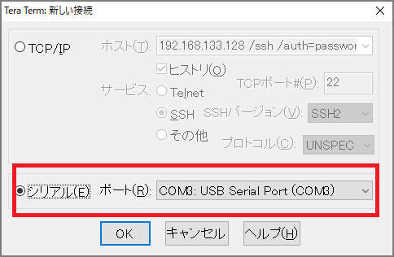

### 2.「設定」-> 「シリアルポート設定」を選択し、以下の項目を設定する

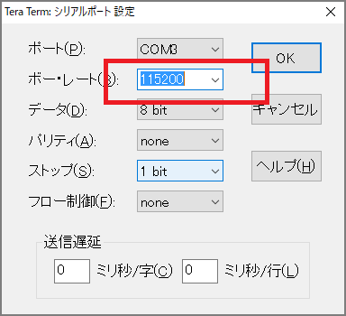

  + ポートレート: 115200
  + データ: 8bit
  + パリティ: none
  + ストップ: 1bit
  + フロー制御: none

### 3.全般で言語：[Engish]を選択する

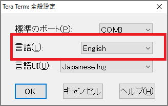

## 2.boot biosの変更

+ lannerの電源を入れる
+ teratermでシリアルコンソールを表示しておく
+ Beepオンが鳴ったときにESCでBIOS SETUP画面を表示

### BIOSのbootタグで「boot option#1」でDVDを設定する(UEFIがある方)

CentOS-7-x86_64-Minimal-1804.isoをUSBメモリで入れて行いました。

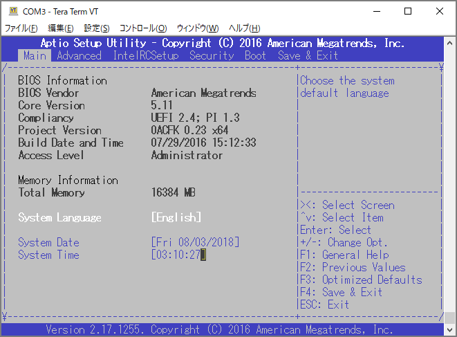

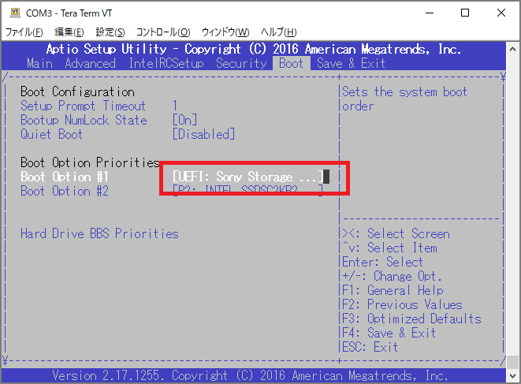

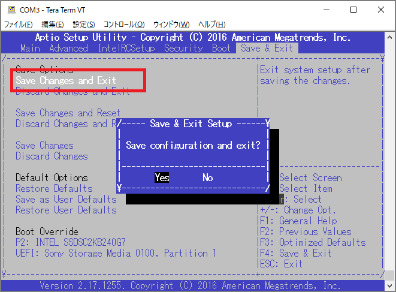

## 3.CentOS7のインストール

### 1.インストールメニューで編集

「Install CentOS7」を選択した状態でeキー入力

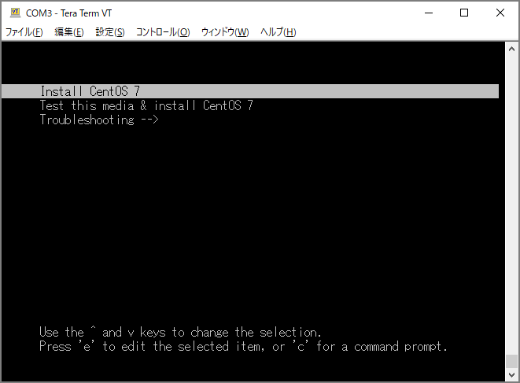

### 2.TEXTモードでインストール

「quiet」を削除し、「console=tty0 console=ttyS0,115200n8 inst.text」を入力し、Ctrl+x

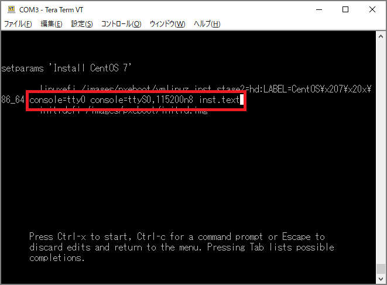

### 3.インストールメニュー

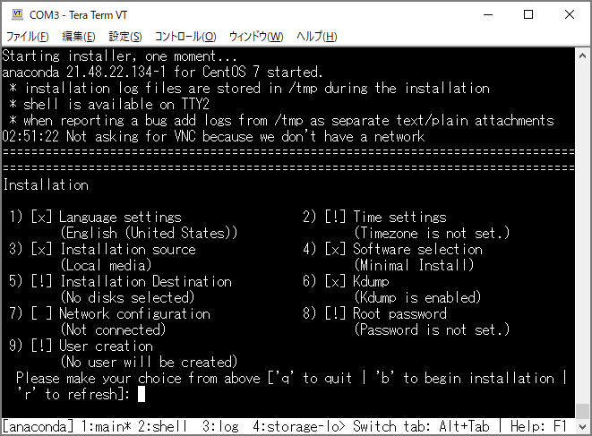

### 3-1.timezoneの設定

2 -> 1(Set timezone) -> 2(Asia) -> ENTER -> 72(Tokyo)

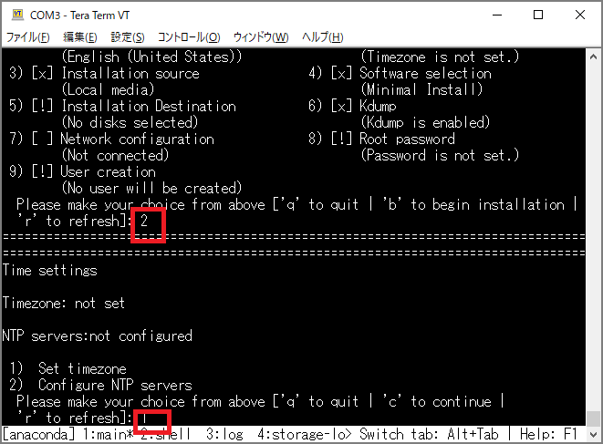

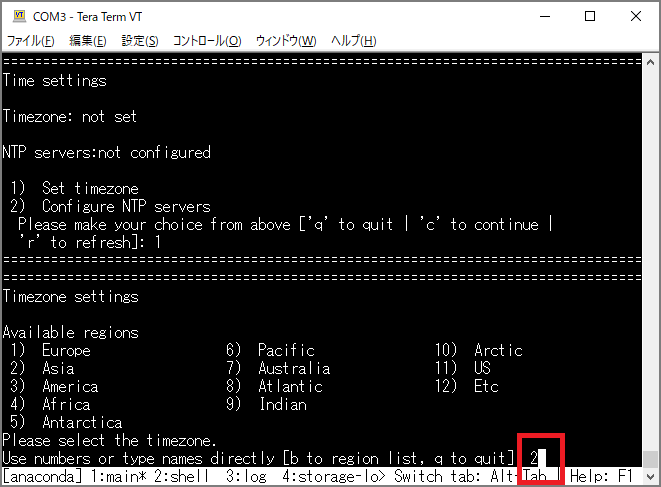

### 3-2.インストール先の選択

5 -> c(INTEL SSD...) -> c(Use All Space) -> c(LVM)

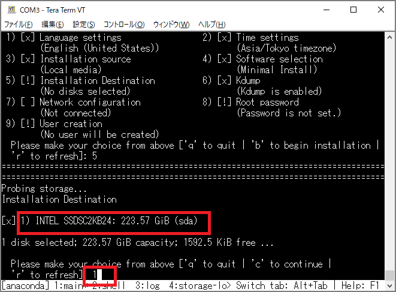

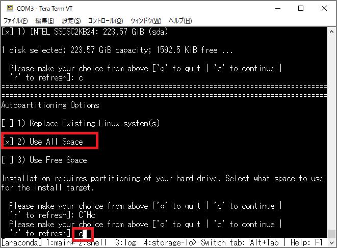

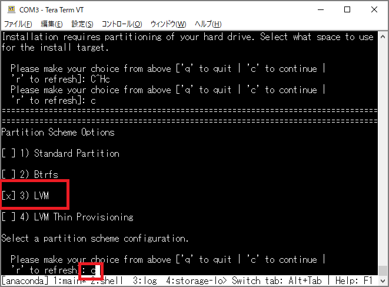

### 3-3.rootパスワードの設定

8 -> root password入力

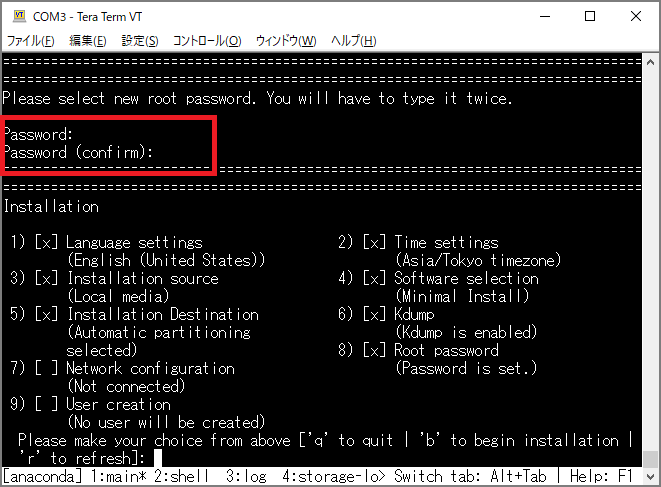

### 3-4.インストールを開始

b(begin installation)

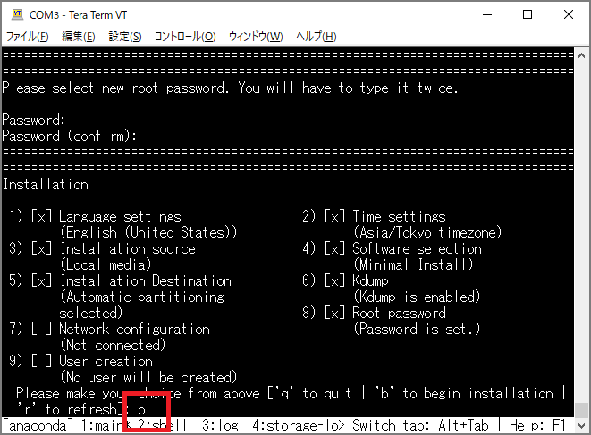

### 3-5.インストール完了

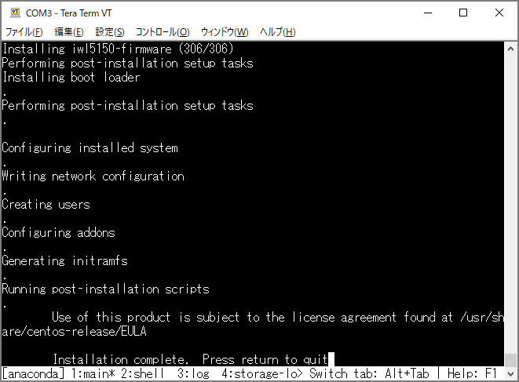

## 4.rootでログイン

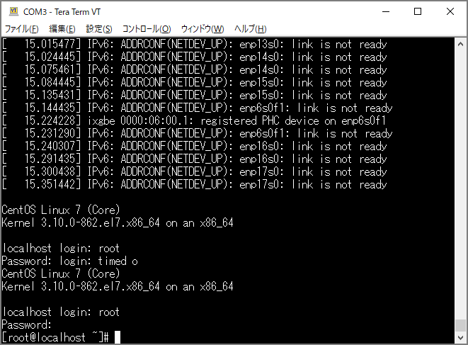

以上